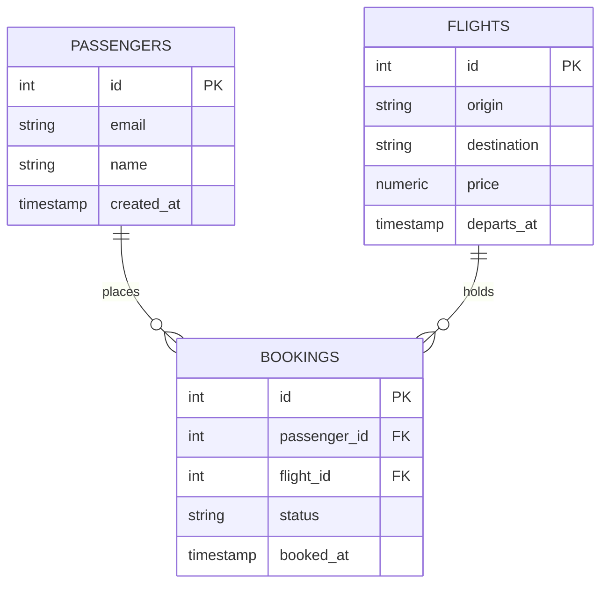
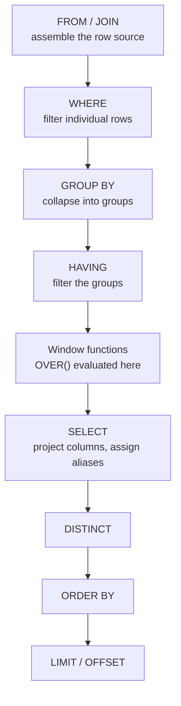
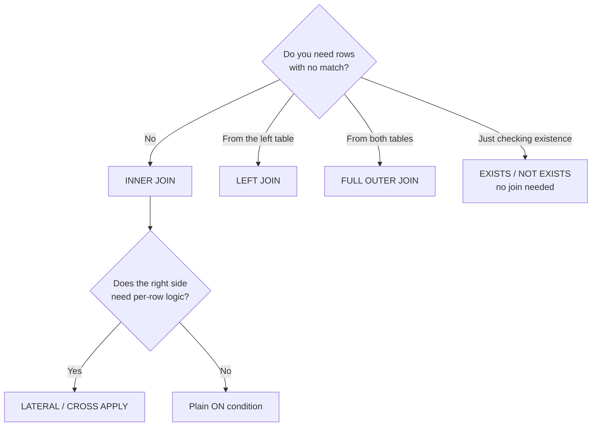

# SQL Reference

A working reference for professional SQL — from `SELECT` through set operators, window functions, and the practices that separate query-that-runs from query-that-ships.

Examples use a consistent schema. Syntax is ANSI/PostgreSQL by default; dialect divergences are flagged inline.

---

## Sample schema

All examples below run against this model.



---

## 1. Logical execution order

SQL is written in one order and evaluated in another. Nearly every "why can't I use my alias there?" question resolves by looking at this list.



Consequences worth memorising:

- A `SELECT` alias is **not** visible in `WHERE`, `GROUP BY`, or `HAVING` — those run first. It *is* visible in `ORDER BY`.
- `WHERE` cannot contain aggregates; aggregation hasn't happened yet. Use `HAVING`.
- `WHERE` cannot contain window functions either — those are evaluated after grouping. Wrap the query in a CTE or subquery to filter on them.
- `LIMIT` applies dead last, so `LIMIT 10` on an unordered query returns an arbitrary ten rows, not "the first ten."

> [!warning] Non-determinism
> A query without `ORDER BY` has no guaranteed row order. It may look stable for months and then change when the planner picks a different access path.

---

## 2. SELECT and projection

```sql
SELECT
    f.id                          AS flight_id,
    f.origin || ' → ' || f.destination AS route,   -- MySQL: CONCAT(...)
    f.price * 1.12                AS price_with_tax
FROM flights AS f;
```

- `AS` is optional for both column and table aliases, but write it for columns — omitting it turns a missing comma into a silent rename bug (`SELECT origin destination` returns one column, not two).
- Avoid `SELECT *` in anything that ships. It breaks when columns are added, transfers unnecessary bytes, and prevents index-only scans.
- Quote identifiers that collide with reserved words: `"rows"`, `"order"`, `` `status` `` in MySQL. Better yet, don't name things that way.

### DISTINCT

`DISTINCT` applies to the entire projected row, not the column it sits next to. `SELECT DISTINCT origin, destination` returns unique *pairs*.

PostgreSQL adds `DISTINCT ON`, which keeps the first row per key given an `ORDER BY`:

```sql
SELECT DISTINCT ON (passenger_id)
       passenger_id, id, booked_at
FROM bookings
ORDER BY passenger_id, booked_at DESC;   -- latest booking per passenger
```

---

## 3. WHERE and three-valued logic

SQL predicates evaluate to **true**, **false**, or **unknown**. Only rows evaluating to true survive a `WHERE`.

| Operator class | Examples |
|---|---|
| Comparison | `=` `<>` `!=` `<` `<=` `>` `>=` |
| Range | `BETWEEN 10 AND 20` (inclusive both ends) |
| Set membership | `IN (…)`, `NOT IN (…)` |
| Pattern | `LIKE 'Jos%'`, `ILIKE` (PG, case-insensitive), `SIMILAR TO`, `~` regex |
| Null test | `IS NULL`, `IS NOT NULL`, `IS DISTINCT FROM` |
| Existence | `EXISTS (…)`, `NOT EXISTS (…)` |

### The NULL rules

```sql
NULL = NULL        -- unknown, NOT true
NULL <> NULL       -- unknown
NULL + 1           -- NULL
'' = NULL          -- unknown (empty string is not NULL)
```

> [!danger] `NOT IN` with NULLs
> If the subquery or list contains a single NULL, `NOT IN` returns **no rows at all**, because `x <> NULL` is unknown for every candidate. Use `NOT EXISTS` instead — it is NULL-safe and usually plans better.

```sql
-- Broken if any archived passenger_id is NULL
SELECT * FROM passengers
WHERE id NOT IN (SELECT passenger_id FROM archived_bookings);

-- Safe
SELECT * FROM passengers p
WHERE NOT EXISTS (
    SELECT 1 FROM archived_bookings a WHERE a.passenger_id = p.id
);
```

`IS DISTINCT FROM` gives you NULL-safe inequality (`<=>` is the MySQL equivalent for equality):

```sql
WHERE old_status IS DISTINCT FROM new_status   -- true when one side is NULL
```

---

## 4. Handling NULLs and conditionals

| Function | Returns |
|---|---|
| `COALESCE(a, b, c)` | First non-NULL argument |
| `NULLIF(a, b)` | NULL if `a = b`, else `a` |
| `CASE` | Full branching expression |
| `GREATEST` / `LEAST` | Max/min across arguments (not rows) |

```sql
SELECT
    COALESCE(NULLIF(email, ''), 'no-email-on-file') AS contact,   -- treats '' as missing
    CASE
        WHEN price = 0            THEN 'comp'
        WHEN price < 100          THEN 'budget'
        WHEN price < 500          THEN 'standard'
        ELSE 'premium'
    END AS price_band
FROM flights f
JOIN passengers p ON TRUE;
```

`CASE` evaluates top to bottom and stops at the first match. An omitted `ELSE` yields NULL.

---

## 5. Aggregation

```sql
SELECT
    f.origin,
    COUNT(*)                  AS total_flights,
    COUNT(f.price)            AS flights_with_price,   -- ignores NULLs
    COUNT(DISTINCT f.destination) AS routes,
    AVG(f.price)              AS avg_price,
    SUM(f.price)              AS revenue
FROM flights f
WHERE f.departs_at >= DATE '2026-01-01'
GROUP BY f.origin
HAVING COUNT(*) > 10
ORDER BY revenue DESC;
```

Rules:

- Every non-aggregated column in `SELECT` must appear in `GROUP BY`. (MySQL relaxes this unless `ONLY_FULL_GROUP_BY` is set — leave it set.)
- **All aggregates except `COUNT(*)` ignore NULLs.** `AVG(price)` over `{100, NULL, 200}` is 150, not 100.
- `SUM` over zero rows returns NULL, not 0. Wrap in `COALESCE(SUM(x), 0)` when feeding a report.
- `COUNT(*)` counts rows; `COUNT(col)` counts non-NULL values. They differ, and reviewers notice.

### Conditional aggregation

The idiom for pivoting multiple counts out of a single table scan:

```sql
-- ANSI / PostgreSQL
SELECT
    COUNT(*) FILTER (WHERE email IS NULL) AS null_email,
    COUNT(*) FILTER (WHERE email = '')    AS empty_email
FROM passengers;

-- Portable equivalent
SELECT
    SUM(CASE WHEN email IS NULL THEN 1 ELSE 0 END) AS null_email,
    SUM(CASE WHEN email = ''    THEN 1 ELSE 0 END) AS empty_email
FROM passengers;
```

### Grouping extensions

| Clause | Effect |
|---|---|
| `GROUP BY GROUPING SETS ((a,b),(a),())` | Explicit list of groupings in one pass |
| `GROUP BY ROLLUP(a, b)` | Hierarchical subtotals plus grand total |
| `GROUP BY CUBE(a, b)` | Every combination of the columns |

`GROUPING(col)` returns 1 when the column was rolled up, letting you label subtotal rows.

---

## 6. Joins

Joins combine tables **horizontally** — matching rows, widening the result.

| Type | Keeps |
|---|---|
| `INNER JOIN` | Only rows matching on both sides |
| `LEFT [OUTER] JOIN` | All left rows; right columns NULL when unmatched |
| `RIGHT [OUTER] JOIN` | All right rows; mirror of LEFT |
| `FULL [OUTER] JOIN` | All rows from both sides |
| `CROSS JOIN` | Cartesian product — every left row × every right row |
| `SELF JOIN` | A table joined to itself under a different alias |
| `LATERAL` / `CROSS APPLY` | Right side may reference columns from the left |



> [!danger] The outer-join filter trap
> A predicate on the *right* table belongs in `ON`, not `WHERE`. Putting it in `WHERE` discards the NULL-extended rows and silently downgrades your `LEFT JOIN` to an `INNER JOIN`.

```sql
-- Wrong: passengers with no bookings are dropped
SELECT p.id, b.id
FROM passengers p
LEFT JOIN bookings b ON b.passenger_id = p.id
WHERE b.status = 'confirmed';

-- Right: filter applied before the join preserves unmatched passengers
SELECT p.id, b.id
FROM passengers p
LEFT JOIN bookings b
       ON b.passenger_id = p.id
      AND b.status = 'confirmed';
```

### Anti-join and semi-join

```sql
-- Semi-join: passengers who have booked (no row duplication)
SELECT * FROM passengers p
WHERE EXISTS (SELECT 1 FROM bookings b WHERE b.passenger_id = p.id);

-- Anti-join: passengers who never booked
SELECT * FROM passengers p
WHERE NOT EXISTS (SELECT 1 FROM bookings b WHERE b.passenger_id = p.id);
```

Prefer these over `JOIN … GROUP BY` or `DISTINCT` — they express intent and avoid fan-out.

> [!tip] Join fan-out
> Joining to a table with multiple matching rows multiplies your row count. Aggregating after a fan-out double-counts. Aggregate in a subquery first, then join to the summary.

---

## 7. Subqueries and CTEs

| Form | Where it lives | Note |
|---|---|---|
| Scalar subquery | Anywhere a value is expected | Must return exactly one row/column |
| `IN` / `ANY` / `ALL` | `WHERE` | Watch the NULL trap |
| `EXISTS` | `WHERE` | NULL-safe, short-circuits |
| Derived table | `FROM (…) AS t` | Alias is mandatory in most engines |
| CTE (`WITH`) | Before the main query | Named, reusable, readable |
| Recursive CTE | `WITH RECURSIVE` | Hierarchies, graphs, generated series |

```sql
WITH revenue_by_flight AS (
    SELECT flight_id, SUM(amount) AS revenue
    FROM bookings
    WHERE status = 'confirmed'
    GROUP BY flight_id
),
top_flights AS (
    SELECT flight_id
    FROM revenue_by_flight
    WHERE revenue > 50000
)
SELECT f.origin, f.destination, r.revenue
FROM top_flights t
JOIN flights f          ON f.id = t.flight_id
JOIN revenue_by_flight r ON r.flight_id = t.flight_id
ORDER BY r.revenue DESC;
```

### Recursive CTE

```sql
WITH RECURSIVE connections AS (
    SELECT id, origin, destination, 1 AS hops
    FROM flights
    WHERE origin = 'MNL'

    UNION ALL

    SELECT f.id, c.origin, f.destination, c.hops + 1
    FROM connections c
    JOIN flights f ON f.origin = c.destination
    WHERE c.hops < 3
)
SELECT * FROM connections;
```

The anchor member runs once; the recursive member runs repeatedly against the previous iteration until it returns no rows. Always bound the recursion — a cyclic graph without a depth guard loops forever.

> [!note] CTE materialisation
> PostgreSQL 12+ inlines CTEs into the parent query by default (it used to always materialise). Force either behaviour with `WITH x AS MATERIALIZED (…)` or `AS NOT MATERIALIZED (…)`. Referencing a CTE twice may compute it twice when inlined.

---

## 8. Window functions

A window function computes across a set of related rows **without collapsing them**. This is the single biggest step up from beginner to professional SQL.

```sql
SELECT
    b.id,
    b.passenger_id,
    b.amount,
    ROW_NUMBER() OVER (PARTITION BY b.passenger_id ORDER BY b.booked_at DESC) AS recency_rank,
    SUM(b.amount) OVER (PARTITION BY b.passenger_id)                          AS passenger_total,
    b.amount - LAG(b.amount) OVER (PARTITION BY b.passenger_id ORDER BY b.booked_at) AS delta_vs_previous
FROM bookings b;
```

### Anatomy of OVER

```
OVER (
    PARTITION BY <cols>     -- reset the calculation per group; omit for whole result
    ORDER BY <cols>         -- defines row sequence within the partition
    <frame>                 -- which rows around the current one to include
)
```

### Function families

| Family | Functions | Notes |
|---|---|---|
| Ranking | `ROW_NUMBER`, `RANK`, `DENSE_RANK`, `NTILE(n)`, `PERCENT_RANK` | Require `ORDER BY` |
| Offset | `LAG`, `LEAD`, `FIRST_VALUE`, `LAST_VALUE`, `NTH_VALUE` | Row-to-row comparison |
| Aggregate | `SUM`, `AVG`, `COUNT`, `MIN`, `MAX` with `OVER` | Running totals, group shares |

Ranking tie behaviour on values `10, 20, 20, 30`:

| Function | Result |
|---|---|
| `ROW_NUMBER()` | 1, 2, 3, 4 — always unique, ties broken arbitrarily |
| `RANK()` | 1, 2, 2, 4 — ties share, then gap |
| `DENSE_RANK()` | 1, 2, 2, 3 — ties share, no gap |

### Frames

| Frame clause | Meaning |
|---|---|
| `ROWS BETWEEN UNBOUNDED PRECEDING AND CURRENT ROW` | Running total, physical rows |
| `ROWS BETWEEN 6 PRECEDING AND CURRENT ROW` | 7-row moving window |
| `RANGE BETWEEN UNBOUNDED PRECEDING AND CURRENT ROW` | Same, but ties count as one peer group |
| `ROWS BETWEEN UNBOUNDED PRECEDING AND UNBOUNDED FOLLOWING` | Whole partition |

> [!warning] The default frame
> With `ORDER BY` present and no explicit frame, the default is `RANGE BETWEEN UNBOUNDED PRECEDING AND CURRENT ROW`. Rows with equal sort keys are treated as peers and all get the same running total — a classic source of "my running sum jumps." Specify `ROWS` explicitly when you mean physical rows.
>
> This is also why `LAST_VALUE(x) OVER (ORDER BY y)` returns the current row rather than the partition's last — the default frame stops at the current row.

Filtering on a window result requires an extra layer, since windows are computed after `WHERE`:

```sql
SELECT * FROM (
    SELECT b.*,
           ROW_NUMBER() OVER (PARTITION BY passenger_id ORDER BY booked_at DESC) AS rn
    FROM bookings b
) ranked
WHERE rn = 1;   -- latest booking per passenger
```

`QUALIFY` does this in one step on Snowflake, BigQuery, DuckDB, and Teradata.

---

## 9. Set operators

Set operators combine result sets **vertically** — same columns, more rows. Contrast with joins, which combine horizontally.

Every branch must return the same column count, in the same order, with compatible types. Column names come from the **first** branch only; matching is positional, never by name.

### The family

| Operator | Returns | Duplicates |
|---|---|---|
| `UNION ALL` | Everything from both branches | Kept |
| `UNION` | Everything from both branches | Removed |
| `INTERSECT` | Rows present in both | Removed |
| `INTERSECT ALL` | Rows present in both | Kept, count = **minimum** of the two |
| `EXCEPT` (Oracle: `MINUS`) | Rows in the first, not the second | Removed |
| `EXCEPT ALL` | Rows in the first, not the second | Kept, count = **subtraction**, floored at 0 |

### Worked comparison

Given `A = {1, 1, 2, 3, 3}` and `B = {2, 3, 3, 4}`:

| Operator | Result | Why |
|---|---|---|
| `A UNION ALL B` | 1, 1, 2, 3, 3, 2, 3, 3, 4 | Straight concatenation |
| `A UNION B` | 1, 2, 3, 4 | Deduplicated |
| `A INTERSECT B` | 2, 3 | Distinct common values |
| `A INTERSECT ALL B` | 2, 3, 3 | min(1,1)=1 of value 2; min(2,2)=2 of value 3 |
| `A EXCEPT B` | 1 | Only value 1 is absent from B |
| `A EXCEPT ALL B` | 1, 1 | 2−0 copies of value 1; 2−2 = 0 copies of value 3 |

`EXCEPT` is the only one that is not commutative — `A EXCEPT B` ≠ `B EXCEPT A`. That makes it the natural tool for reconciliation ("what exists in prod but not in the archive?").

### NULL semantics differ here

Set operators match rows using *not distinct from*, so **two NULLs count as equal** — unlike everywhere else in SQL.

```sql
SELECT NULL INTERSECT SELECT NULL;   -- returns one row
```

Which is why `A EXCEPT B` is not equivalent to `LEFT JOIN … WHERE b.key IS NULL` when keys are nullable.

### Precedence

`INTERSECT` binds tighter than `UNION` and `EXCEPT`, which are equal and left-associative.

```sql
A UNION B INTERSECT C   -- means A UNION (B INTERSECT C)
```

Always parenthesise mixed operators. Oracle historically treated all set operators as equal precedence, so the same query can differ across engines.

### Clause placement

`ORDER BY` / `LIMIT` at the end apply to the **whole** result and may only reference names from the first branch. Parenthesise a branch to scope them locally.

```sql
(SELECT name FROM passengers ORDER BY created_at DESC LIMIT 10)
UNION ALL
(SELECT name FROM archived_passengers ORDER BY created_at DESC LIMIT 10)
ORDER BY name;
```

### Dialect support

| | PostgreSQL | MySQL | SQL Server | Oracle | SQLite |
|---|---|---|---|---|---|
| `UNION` / `UNION ALL` | ✅ | ✅ | ✅ | ✅ | ✅ |
| `INTERSECT` | ✅ | 8.0.31+ | ✅ | ✅ | ✅ |
| `EXCEPT` | ✅ | 8.0.31+ | ✅ | `MINUS` | ✅ |
| `INTERSECT ALL` / `EXCEPT ALL` | ✅ | 8.0.31+ | ❌ | recent only | ❌ |

Where the `ALL` variants are missing, emulate with `EXISTS` / `NOT EXISTS`, or by joining on `ROW_NUMBER()` partitioned by the row's columns.

> [!tip] Performance
> Only the `ALL` variants stream. The deduplicating forms must materialise and sort or hash the full row width. If branches are already disjoint, `UNION ALL` is strictly correct and strictly cheaper.

### Idiomatic use: the data-quality audit

```sql
SELECT 'zero-price flight' AS scenario, COUNT(*) AS row_count FROM flights WHERE price = 0
UNION ALL
SELECT 'null email',        COUNT(*) FROM passengers WHERE email IS NULL
UNION ALL
SELECT 'empty-string email',COUNT(*) FROM passengers WHERE email = ''
UNION ALL
SELECT 'archived bookings', COUNT(*) FROM archived_bookings;
```

Each branch yields one labelled row; `UNION ALL` staples them into a small report.

---

## 10. Modifying data

```sql
INSERT INTO passengers (email, name) VALUES ('a@x.com', 'Ana');

INSERT INTO passengers (email, name)
SELECT email, name FROM staging_passengers WHERE email IS NOT NULL;

UPDATE bookings
SET status = 'cancelled', updated_at = NOW()
WHERE flight_id = 42 AND status = 'confirmed';

DELETE FROM bookings WHERE booked_at < DATE '2020-01-01';
```

> [!danger] Always dry-run
> Run the `WHERE` clause as a `SELECT COUNT(*)` first. An `UPDATE` or `DELETE` without `WHERE` hits every row, and autocommit means there is nothing to roll back.

### RETURNING

PostgreSQL, SQLite, MariaDB, and Oracle can return the affected rows in one round trip:

```sql
UPDATE bookings SET status = 'cancelled'
WHERE flight_id = 42
RETURNING id, passenger_id;
```

### Upsert

| Dialect | Syntax |
|---|---|
| PostgreSQL / SQLite | `INSERT … ON CONFLICT (col) DO UPDATE SET …` |
| MySQL | `INSERT … ON DUPLICATE KEY UPDATE …` |
| ANSI / SQL Server / Oracle | `MERGE INTO … USING … WHEN MATCHED THEN …` |

```sql
INSERT INTO passengers (email, name)
VALUES ('a@x.com', 'Ana Reyes')
ON CONFLICT (email) DO UPDATE
SET name = EXCLUDED.name;
```

### Transactions

```sql
BEGIN;
    UPDATE accounts SET balance = balance - 100 WHERE id = 1;
    UPDATE accounts SET balance = balance + 100 WHERE id = 2;
COMMIT;   -- or ROLLBACK;
```

Isolation levels, weakest to strongest: `READ UNCOMMITTED` → `READ COMMITTED` (PostgreSQL default) → `REPEATABLE READ` (MySQL InnoDB default) → `SERIALIZABLE`. Higher isolation trades throughput for fewer anomalies (dirty reads, non-repeatable reads, phantoms).

DDL is transactional in PostgreSQL and SQL Server; in MySQL and Oracle it implicitly commits. Plan migrations accordingly.

---

## 11. DDL essentials

```sql
CREATE TABLE bookings (
    id            BIGSERIAL PRIMARY KEY,
    passenger_id  BIGINT      NOT NULL REFERENCES passengers(id) ON DELETE CASCADE,
    flight_id     BIGINT      NOT NULL REFERENCES flights(id),
    status        TEXT        NOT NULL DEFAULT 'pending'
                              CHECK (status IN ('pending','confirmed','cancelled')),
    amount        NUMERIC(10,2) NOT NULL CHECK (amount >= 0),
    booked_at     TIMESTAMPTZ NOT NULL DEFAULT NOW(),
    UNIQUE (passenger_id, flight_id)
);

CREATE INDEX idx_bookings_flight_status ON bookings (flight_id, status);
```

| Constraint | Guarantees |
|---|---|
| `PRIMARY KEY` | Unique + not null, one per table |
| `FOREIGN KEY` | Referential integrity; specify `ON DELETE` behaviour |
| `UNIQUE` | No duplicates (multiple NULLs usually allowed) |
| `CHECK` | Arbitrary row-level predicate |
| `NOT NULL` | Value required |
| `DEFAULT` | Value when omitted on insert |

Type notes: use `NUMERIC`/`DECIMAL` for money, never `FLOAT` — binary floating point cannot represent 0.10 exactly. Use `TIMESTAMPTZ` (`TIMESTAMP WITH TIME ZONE`) for events; naive timestamps lose meaning across regions.

---

## 12. Performance practices

### Sargability

A predicate is *sargable* if the engine can use an index to satisfy it. Wrapping an indexed column in a function destroys that.

```sql
-- Not sargable: full scan
WHERE DATE(booked_at) = '2026-08-24'
WHERE UPPER(email) = 'A@X.COM'
WHERE amount + 0 > 100

-- Sargable rewrites
WHERE booked_at >= '2026-08-24' AND booked_at < '2026-08-25'
WHERE email = 'a@x.com'                 -- or index on UPPER(email)
WHERE amount > 100
```

Leading wildcards (`LIKE '%son'`) can't use a standard B-tree either — you need a trigram index or full-text search.

### Composite index ordering

A B-tree index on `(flight_id, status)` serves queries filtering on `flight_id`, or on `flight_id AND status` — the **leftmost prefix**. It does not serve a query filtering on `status` alone. Order columns by selectivity and by how they're queried, not alphabetically.

### Reading a plan

```sql
EXPLAIN ANALYZE SELECT …;
```

What to look for: sequential scans on large tables, estimated vs actual row counts diverging by orders of magnitude (stale statistics), nested loops over big inputs, and sorts spilling to disk.

### General habits

- Filter as early and as narrowly as possible; every row eliminated in `WHERE` is a row never joined or sorted.
- Aggregate before joining when the join would fan out.
- `EXISTS` over `IN` for subqueries on large sets; `EXISTS` short-circuits on the first match.
- Prefer keyset pagination (`WHERE id > :last_id ORDER BY id LIMIT 50`) over `OFFSET 100000`, which still reads and discards 100,000 rows.

---

## 13. Safety and style

> [!danger] Never concatenate user input into SQL
> Use parameterised queries. String interpolation is how SQL injection happens, regardless of how much escaping you think you've done.
> ```python
> cur.execute("SELECT * FROM passengers WHERE email = %s", (email,))
> ```

Style conventions that survive code review:

- Keywords uppercase, identifiers lowercase `snake_case`.
- One clause per line; indent join conditions under their `JOIN`.
- Always alias tables in multi-table queries and qualify every column — unqualified columns break the day someone adds a same-named column to the other table.
- Leading commas or trailing commas — pick one and be consistent.
- Comment the *why*, not the *what*. `-- promo flights are priced at 0, not NULL` beats `-- filter price`.
- Avoid `SELECT *`, ordinal `ORDER BY 3`, and implicit comma joins (`FROM a, b`).

---

## 14. Common pitfalls checklist

- [ ] `NOT IN` against a nullable column → use `NOT EXISTS`
- [ ] Right-table filter in `WHERE` silently converting a `LEFT JOIN` to inner
- [ ] `COUNT(col)` where `COUNT(*)` was intended
- [ ] `AVG` / `SUM` silently skipping NULLs
- [ ] `SUM` returning NULL instead of 0 over an empty set
- [ ] `LIMIT` without `ORDER BY`
- [ ] Default window frame using `RANGE` and grouping tied peers
- [ ] Join fan-out double-counting an aggregate
- [ ] Mixed set operators without parentheses
- [ ] `UNION` where `UNION ALL` was meant (paying for a needless sort)
- [ ] Column alias referenced in `WHERE` or `GROUP BY`
- [ ] `FLOAT` used for currency
- [ ] `BETWEEN` on timestamps catching or missing the boundary second

