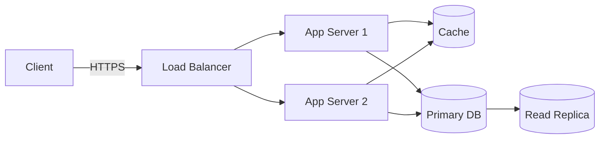

## System Design Basics
*Foundational concepts for designing scalable systems - increasingly common in professional-grade interviews*

### Example Architecture

### Client-Server Model
- Clients request services/resources; servers provide them
- Communication typically happens over HTTP/HTTPS

### Scalability
##### Vertical Scaling (Scale Up)
- Add more resources (CPU/RAM) to a single machine
- Simple, but has a hardware ceiling
##### Horizontal Scaling (Scale Out)
- Add more machines to share the load
- More resilient, but adds coordination complexity

### Load Balancing
*Distributes incoming traffic across multiple servers*
- Common algorithms: Round Robin, Least Connections, IP Hash
- Improves availability and prevents any single server from being overwhelmed

### Caching
*Stores frequently accessed data closer to where it's needed to reduce latency*
- Layers: client-side (browser), CDN, application-level (Redis/Memcached), database query cache
##### Cache Invalidation Strategies
- Write-through -> write to cache and DB at the same time
- Write-back -> write to cache first, DB updated later
- Cache-aside -> application checks cache first, falls back to DB and populates cache on a miss

### Database Scaling
##### Replication
- Copies of the same database across multiple servers - improves read throughput and availability
##### Sharding (Partitioning)
- Splits data across multiple databases by a shard key - improves write throughput at the cost of complexity
##### Indexing
- Speeds up reads by avoiding full table scans - see [[SQL]] for indexing details

### CAP Theorem
*In a distributed system, only 2 of 3 can be guaranteed during a network partition*
- Consistency -> every read gets the latest write
- Availability -> every request gets a response
- Partition Tolerance -> the system keeps working despite network failures

### Monolith vs Microservices

| Aspect             | Monolith                          | Microservices                          |
| -------------------- | ------------------------------------ | ----------------------------------------- |
| Deployment            | Single unit                          | Independently deployable services        |
| Scaling               | Scale the whole app                  | Scale services independently             |
| Complexity            | Simpler to start                     | More operational overhead                |
| Communication         | In-process function calls            | Network calls (REST/gRPC/message queues) |
| Failure Isolation      | One failure can affect the whole app  | Failures can be isolated per service      |

### Message Queues
*Decouples services by passing messages asynchronously*
- Examples: RabbitMQ, Kafka, SQS
- Use cases: background jobs, event-driven architecture, smoothing traffic spikes

### API Gateway
- Single entry point that routes requests to the appropriate backend service
- Handles cross-cutting concerns: authentication, rate limiting, logging

### Common Interview Framework
1. Clarify requirements (functional + non-functional: scale, latency, consistency needs)
2. Estimate scale (users, requests/sec, data size)
3. High-level design (draw the major components)
4. Deep dive on 1-2 critical components
5. Identify bottlenecks and discuss trade-offs
