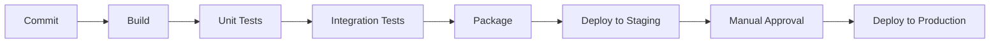

## CI/CD Pipelines
*Automating build, test, and release so changes reach production safely and often*

### Continuous Integration (CI)
- Developers merge code into a shared branch frequently (multiple times a day)
- Every merge triggers an automated build and test run
- Goal: catch integration issues early

### Continuous Delivery vs Continuous Deployment

| Aspect               | Continuous Delivery | Continuous Deployment |
| ---------------------- | ---------------------- | ------------------------ |
| Release to production   | Manual trigger          | Fully automated          |
| Deployable state        | Always deployable        | Always deployed           |
| Human gate              | Yes                      | No                        |

### Pipeline Stages


### Common CI/CD Tools
- Jenkins - self-hosted, highly configurable, plugin ecosystem
- GitHub Actions - YAML workflows triggered by repo events
- GitLab CI/CD - built into GitLab, `.gitlab-ci.yml`
- CircleCI - cloud-native CI/CD

### Sample Pipeline (GitHub Actions)
```yaml
name: CI
on: [push]
jobs:
  build:
    runs-on: ubuntu-latest
    steps:
      - uses: actions/checkout@v4
      - name: Install dependencies
        run: npm install
      - name: Run tests
        run: npm test
      - name: Build
        run: npm run build
```

### Deployment Strategies

##### Blue-Green Deployment
- Two identical environments (Blue = live, Green = new version)
- Traffic switches instantly once Green is verified - easy rollback

##### Canary Deployment
- New version rolled out to a small percentage of users first
- Gradually increased if no issues are detected

##### Rolling Deployment
- Instances updated gradually, one batch at a time
- No downtime, but old and new versions run simultaneously during rollout

### Rollback Strategies
- Automated rollback triggered by failed health checks
- Feature flags -> toggle new functionality off without a redeploy

### Common Interview Questions
- What's the difference between Continuous Delivery and Continuous Deployment?
- Walk through a CI/CD pipeline you've built or worked with
- How would you roll back a bad deployment?
- What's a feature flag and why use one?
