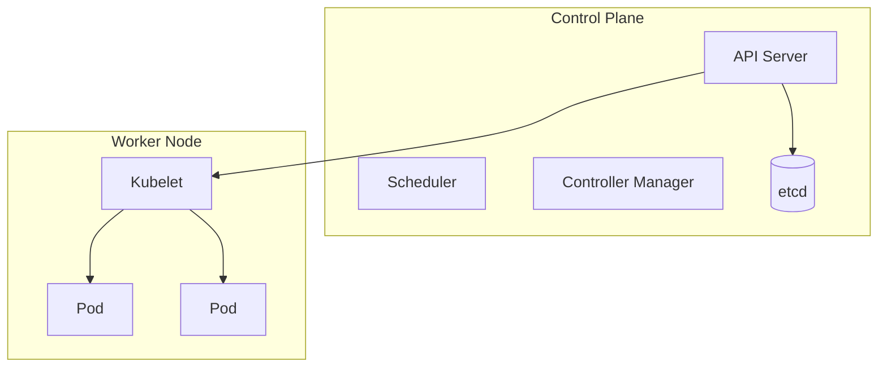

## Containers & Orchestration
*Packaging applications with their dependencies for consistent, portable environments*

### Why Containers?
- Solves "it works on my machine" - bundles the app, runtime, libraries, and config together
- Lighter weight than virtual machines - shares the host OS kernel

### Containers vs Virtual Machines

| Aspect       | Container            | Virtual Machine        |
| ------------- | ----------------------- | -------------------------- |
| Isolation      | Process-level            | Full OS-level              |
| Startup Time   | Seconds                  | Minutes                    |
| Size           | MBs                      | GBs                        |
| OS             | Shares host kernel        | Full guest OS per VM       |

### Docker Basics

##### Key Concepts
- Image -> a read-only template with the app and its dependencies
- Container -> a running instance of an image
- Dockerfile -> instructions to build an image
- Registry -> stores images (Docker Hub, ECR, GCR)

##### Common Commands
```
docker build -t myapp .
docker run -d -p 8080:80 myapp
docker ps
docker stop <container-id>
docker images
docker exec -it <container-id> bash
docker-compose up
```

##### Sample Dockerfile
```dockerfile
FROM node:20-alpine
WORKDIR /app
COPY package*.json ./
RUN npm install
COPY . .
EXPOSE 3000
CMD ["npm", "start"]
```

### Kubernetes Basics
*Orchestrates containers at scale - scheduling, scaling, self-healing*

##### Key Concepts
- Pod -> smallest deployable unit, one or more containers sharing storage/network
- Deployment -> manages a set of replica Pods, handles rollouts and self-healing
- Service -> stable network endpoint that load-balances traffic to Pods
- Ingress -> manages external HTTP(S) access and routing
- ConfigMap/Secret -> externalize configuration and sensitive data

### Architecture


### Common kubectl Commands
```
kubectl get pods
kubectl get deployments
kubectl apply -f deployment.yaml
kubectl describe pod <pod-name>
kubectl logs <pod-name>
kubectl scale deployment myapp --replicas=5
kubectl rollout undo deployment myapp
```

### Common Interview Questions
- What problem do containers solve that VMs don't?
- What happens when a Pod crashes in Kubernetes?
- How does a Kubernetes Service differ from a Deployment?
- How would you roll back a bad Kubernetes deployment?
