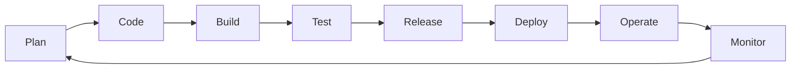

## What is DevOps?
- A culture and set of practices that unifies software development (Dev) and IT operations (Ops) to deliver high-quality software faster and more reliably
### Key Goals
- Faster, more frequent releases
- Improved collaboration between Dev, Ops, and QA
- Automated, repeatable processes
- Faster recovery from failures
### Essential Skills
- Version control (Git)
- Scripting (Bash/Python)
- CI/CD pipeline design
- Cloud platforms (AWS/Azure/GCP)
- Containers & orchestration (Docker/Kubernetes)
- Infrastructure as Code
- Monitoring & observability
- Linux fundamentals

## CALMS Framework
*Five pillars commonly used to describe DevOps culture*
- Culture -> shared ownership between Dev and Ops, blameless postmortems
- Automation -> automate builds, tests, deployments, and infrastructure
- Lean -> small batch sizes, fast feedback, eliminate waste
- Measurement -> track metrics that matter (deployment frequency, lead time, MTTR, change failure rate)
- Sharing -> knowledge sharing and cross-team collaboration

## The DevOps Lifecycle

- A continuous loop, not a one-way pipeline - feedback from Monitor informs the next Plan

## DORA Metrics
*Four key metrics used to measure DevOps performance (from Google's DevOps Research and Assessment team)*

| Metric                          | What It Measures                                    |
| ---------------------------------- | ------------------------------------------------------ |
| Deployment Frequency               | How often code is deployed to production              |
| Lead Time for Changes               | Time from commit to running in production              |
| Change Failure Rate                | % of deployments causing a failure in production        |
| Mean Time to Recovery (MTTR)        | How quickly service is restored after an incident       |

## CI/CD
*Automating the build, test, and release process*
- Continuous Integration -> merging code frequently, validated by automated builds/tests
- Continuous Delivery -> code is always in a deployable state, deployment is a manual trigger
- Continuous Deployment -> every change that passes tests is automatically deployed to production
- Full pipeline reference -> see [[CI-CD Pipelines]]

## Infrastructure as Code (IaC)
*Managing infrastructure through code instead of manual processes*
- Enables version-controlled, repeatable, auditable infrastructure changes
- Full reference -> see [[Cloud and Infrastructure as Code]]

## Containers & Orchestration
*Packaging applications with their dependencies for consistent environments*
- Full reference -> see [[Containers and Orchestration]]

## Cloud Computing
*On-demand access to computing resources over the internet*
- Full reference -> see [[Cloud and Infrastructure as Code]]

## Monitoring & Observability
*Understanding system health and behavior in production*
- Full reference -> see [[Monitoring and Observability]]

## Deployment Strategies
- Blue-Green, Canary, and Rolling deployments - full detail -> see [[CI-CD Pipelines]]

## Configuration Management
- Ansible, Chef, Puppet - keep servers in a consistent, defined state
- Full reference -> see [[Cloud and Infrastructure as Code]]

## Security (DevSecOps)
- Shift-left -> integrate security checks early in the pipeline, not just before release
- Secrets management -> never hardcode credentials; use a vault (HashiCorp Vault, AWS Secrets Manager)
- Full application security fundamentals -> see [[Dev Foundations]] `Security Fundamentals`
