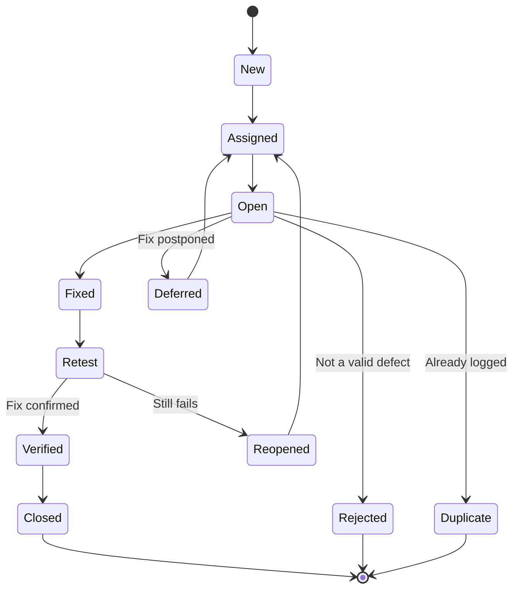

## Defect Management
*What happens to a bug from the moment it's found to the moment it's closed*

### What is a Defect?
- A flaw in the system that causes it to behave in an unintended way - a deviation from the expected result defined by requirements
##### Common Causes
- Coding errors
- Requirement misunderstanding or ambiguity
- Missed edge cases
- Environment/configuration issues
- Integration mismatches between components

### Defect Life Cycle

| Status     | Meaning                                                         |
| ------------ | ------------------------------------------------------------------ |
| New          | Defect logged, not yet triaged                                   |
| Assigned     | Triaged and assigned to a developer                               |
| Open         | Developer is actively working on it                               |
| Fixed        | Developer believes the issue is resolved, ready for retest         |
| Retest       | Tester re-executes the failing steps against the fix               |
| Verified     | Retest passed - fix confirmed                                      |
| Reopened     | Retest failed - the fix didn't work, sent back to the developer    |
| Closed       | Verified and no further action needed                              |
| Deferred     | Valid defect, but fix is postponed to a later release              |
| Rejected     | Not a valid defect (works as designed, environment issue, etc.)    |
| Duplicate    | Already reported under a different defect ID                      |

### Severity vs Priority
*The two axes every defect is triaged on - they don't always move together*
- Severity -> how badly the defect impacts the system (technical impact)
- Priority -> how quickly it needs to be fixed (business urgency)

| Severity \ Priority | High Priority                                  | Low Priority                                     |
| ---------------------- | -------------------------------------------------- | ---------------------------------------------------- |
| High Severity            | App crashes on login (fix immediately)              | Rare data-corruption edge case in an unused module (fix soon, but not blocking) |
| Low Severity             | Company logo shown wrong on the homepage (fix fast - high visibility) | Typo in a rarely-visited help page (fix whenever)     |

- Classic interview trap: high severity does not automatically mean high priority, and vice versa - a cosmetic typo on the login page (low severity) can be high priority because of visibility

##### Severity Levels (typical scale)
- Critical -> system crash, data loss, complete blocker, no workaround
- Major/High -> core feature broken, workaround may exist
- Minor/Medium -> feature partially broken, workaround exists
- Trivial/Low -> cosmetic issue, no functional impact

### Anatomy of a Good Bug Report
| Field              | Example                                                        |
| -------------------- | ------------------------------------------------------------------ |
| Title                | "Login fails with 500 error when password contains an emoji"      |
| Steps to Reproduce    | 1. Go to login 2. Enter valid email 3. Enter password "test😀123" 4. Click Login |
| Expected Result       | User is logged in                                                  |
| Actual Result         | Page shows a 500 Internal Server Error                             |
| Environment            | Chrome 120, staging, Windows 11                                    |
| Severity / Priority    | Major / High                                                       |
| Attachments            | Screenshot, console log, network trace                             |

- A reproducible bug report is the difference between a same-day fix and a week of back-and-forth - always include exact steps, not a paraphrase

### Defect Metrics
| Metric                 | What It Tells You                                              |
| ------------------------- | -------------------------------------------------------------------- |
| Defect Density              | Defects per size unit (e.g. per 1,000 lines of code, or per module)  |
| Defect Leakage               | Defects found in production that QA missed - measures test effectiveness |
| Defect Rejection Rate         | % of logged defects rejected as invalid - high rate suggests unclear reports or requirements |
| Defect Removal Efficiency (DRE) | % of defects found before release vs. total defects found (before + after) |

### Common Interview Questions
- Walk through the defect life cycle from discovery to closure
- What's the difference between severity and priority? Give an example where they diverge
- What makes a bug report "good" vs "bad"?
- What's the difference between a rejected and a deferred defect?
- How would you handle a defect a developer marked as "not reproducible"?
