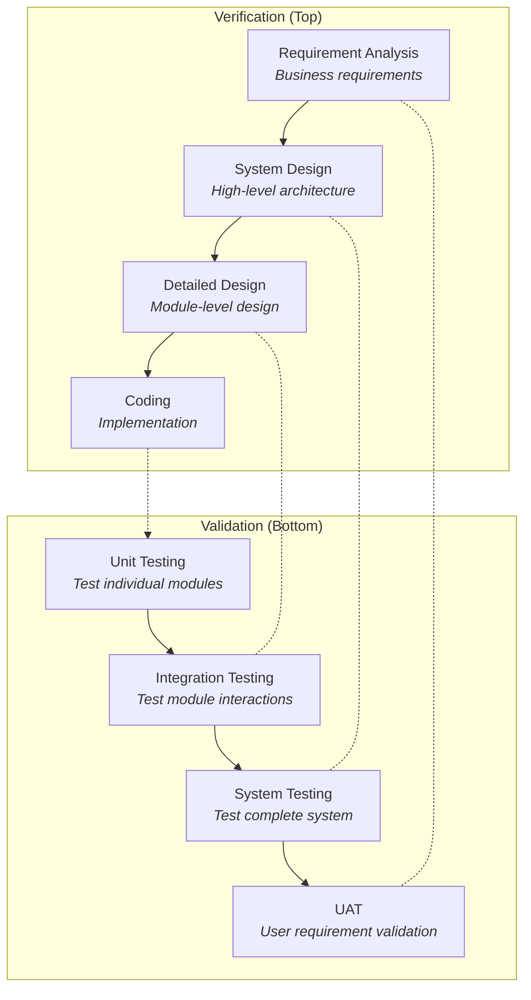

## What is QA Testing?
- Systematic Process of ensuring software applications meet specified requirements and functions correctly before reaching the stake holders or end Users
### Key Responsibilities
- Finding and documenting defects
	- Systematic bug detection and analysis
- Verifying features work according to specifications
	- Requirements validation
- Ensuring applications are user-friendly
	- UX/UI Testing
- Performance and security Validation
	- Non - Functional Testing

### Essential Skills
- Creation of Test Cases
- Creation of Bug Reports
- Knowledge of Automation Tools
- Knowledge to conduct API Test

## Testing Principles
1. Testing shows the presence of Defects
	- Testing helps detect and identify system defects but it cannot prove that the system is completely error-free
2. Exhaustive Testing is not Possible
	- Testing everything is not feasible except in trivial cases. Risk analysis and priorities should guide test activities.
3. Early Testing
	- Testing should start as early as possible within the SDLC and it should be focused on the defined objectives of the team
4. Defect Clustering
	- Small number of modules contains the majority of defects.
	- Following the Pareto Principle - Approximately 80% are found in 20% of the modules.
5. Pesticide Paradox
	- Repeated execution of the same test cases will eventually stop finding new Defects
	- Test Cases must be regularly reviewed, updated, and improved
6. Testing is Context-Dependent
	- Test strategies vary depending on the type of software.
7. Absence of Errors Fallacy
	- If a system is without defects but fails to meet user requirements / Business needs, It is a failure.
### Importance of testing Principles
- Detects defects early
- Reduces development cost and effort
- Provide structured and systematic approach to testing
- avoids unnecessary or repetitive testing efforts
- ensures optimal use of time, resources, and testing tools
- helps Testers focus on high-risk and critical areas of Software
- Supports better decision-making during test planning and execution

## SDLC - `Software Develpoment Life Cycle`
### Waterfall Model
1. Requirements
2. Design
3. Implementation
4. Testing
5. Deployment
6. Maintenance

### V-Model (Verification & Validation)
- Testing at each Development Phase
```
Requirements    ->  User Acceptance Test
System Design   ->  System Testing
Detailed Design ->  Integration Testing
Coding          ->  Unit Testing
```

### Agile vs Waterfall

| Agile                                     | Waterfall                              |
| ----------------------------------------- | -------------------------------------- |
| Testing through out the development cycle | Testing phase starts after develpoment |
| Collaborative approach                    | Detailed documentation required        |
| Iterative process                         | Sequential process                     |
| High flexibility for changes              | Less flexibility for change            |
| Continuous Feedback                       | Good for stable requirements           |

## STLC - `Software Testing Life Cycle`

1. Requirement Analysis
	- Understanding requirements
	- Identification of Testable Scenarios
	#### Activities
		- Analuze Functional & Non-Functional Requirements
		- Identify Test Conditions
		- Review Acceptance Criteria
	#### Deliverables
		- TEst Strategy Document
		- Test Conditions
		- Automation Feasibility Report
		
	
2. Test Planning
	- Define Test Approach, Scope, Resources, and Timeline
	#### Activities
		- Define test scope and approach
		- Estimate effort and timeline
		- Identify resources and roles
	#### Deliverables
		- Test Plan Document
		- Test estimation
		- Resource Planning
	
3. Test Case Design & Development
	- Creation of detailed test cases and test data
	#### Activities
		- Create test cases from requirements
		- Develop automation scripts
		- Prepare test data
	#### Deliverables
		- Test cases document
		- Test Scripts
		- Test Data sets
	
4. Test Environment Setup
	- Prepare test environment and test data
	#### Activities
		- Setup test environment
		- Install required software
		- Configure Test Data
	#### Deliverables
		- Environment setup document
		- Test data creation
		- Smoke test results
5. Test Case Execution
	- Execution of test cases and reports of defects
	#### Activities
		- Execute Test Cases
		- Log defects in bug tracking tool
		- Retest fixed defects
	#### Deliverables
		- Test execution results
		- Defect reports
		- Test logs
6. Test Reporting
	- Analyzation of results
	- Creation of `test summary results`
	#### Activities
	- Evaluate Test completion criteria
	- Analyze metrics and coverage
	- Prepare final report
	##### Deliverables
	- Test Summary Report
	- Test metrics
	- Test coverage Report
7. Test Closure
	- Document lessons learned and archive test artifacts
	#### Activities
		- Document lessons learned
		- Archive test artifacts
		- Analuze process improbements
	#### Deliverables
		- Test closure report
		- Best practices document
		- Test artifacts archive


## Testing Levels

#### Unit Testing
 *Smallest Testable Parts of an application
- Testing individual components or modules in isolation
##### Characteristics
- Test individual functions/methods
- Fast execution (Usually done in milliseconds)
- Easy to write and maintain
- High code coverage is possible
- Done by Developers
- Uses mocks/stubs for dependencies

#### Integration Testing
*Testable Interaction between components or systems
- Testing the interfaces and interaction between integrated components or systems

#### System Testing
*Testable complete integrated system*
- Testing the complete integrated system to verify it meets specified requirements

##### System Test Areas:
- Functionality       -> All Features work Correctly
- Reliability            -> System stability over time
- Performance       -> Speed and responsiveness
- Security              -> Data protection and access control

#### User Acceptance Testing `[UAT]`
*Tests performed by end users*
- Final Testing performed by end users to ensure the system meets business requirements.

##### Alpha Testing
- Performed by internal users/employees
- Controlled environment 
- Performed before beta testing
##### Beta Testing
- Performed by external users
- Real-wolrd environment
- Limited user group
#### Distribution of different types of tests in a project
```
	 /	UI Tests (2%)      \
	/  System Tests (8%)    \
   / Integration Tests (20%) \
  /    Unit Tests (70%)       \
```

## V-Model  - `[Verification & Validation]`

Extension of the waterfall model Where testing activities are planned in parallel corresponding to the development phases

##### Verification(Left Side)
	- Static Testing activities
	- Reviews and walkthroughs
	- Document analysis
	- "Are we building the product right?"
##### Validation (Right Side)
	- Dynamic testing activities
	- Actual test execution
	- COde execution with test data
	- "Are we building the right product?"

#### V-Model Phase Mapping



| Benefits                       | Disadvantages                   |
| ------------------------------ | ------------------------------- |
| Early test planning and design | Rigid and less flexible         |
| Better defect prevention       | Difficult to accomodate changes |
| Clear Testing objectives       | No early prototypes             |
| Higher quality deliverables    | High risk for complex projects  |


