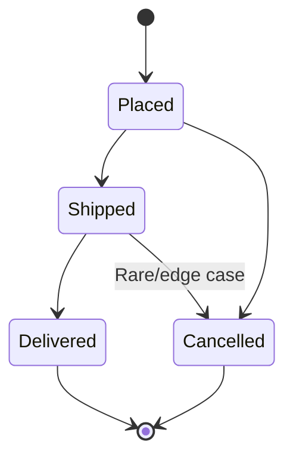

## Test Design Techniques
*Black-box methods for choosing which test cases to write, without needing to see the code - the manual/functional-testing counterpart to the white-box coverage techniques in [[Test Types]]*

### Equivalence Partitioning (EP)
*Groups inputs into partitions expected to be handled the same way, so you only need one test per partition instead of testing every possible value*

Example - an age field that must be between 18 and 60:

| Partition            | Example Value | Expected Result |
| ---------------------- | ---------------- | ------------------ |
| Invalid (too low)        | 10                | Rejected           |
| Valid                    | 30                | Accepted           |
| Invalid (too high)        | 75                | Rejected           |

- One representative test per partition is enough - testing 19, 20, 21, and 22 separately adds no new information if they're in the same partition

### Boundary Value Analysis (BVA)
*Most defects cluster at the edges of a range, not in the middle - test the boundaries directly*

Same age field (valid range 18-60):

| Test Value | Expected Result |
| ------------ | ------------------ |
| 17           | Rejected (just below boundary) |
| 18           | Accepted (boundary)             |
| 60           | Accepted (boundary)             |
| 61           | Rejected (just above boundary) |

- Almost always paired with Equivalence Partitioning: EP picks the partitions, BVA stress-tests their edges

### Decision Table Testing
*Tests combinations of business rules/conditions, useful when behavior depends on multiple inputs at once*

Example - a discount rule: 10% off if the user is a member AND cart total > $100

| Is Member | Cart > $100 | Discount Applied |
| ----------- | ------------- | ------------------- |
| Yes          | Yes           | Yes                 |
| Yes          | No            | No                  |
| No           | Yes           | No                  |
| No           | No            | No                  |

- Every row is one test case - guarantees every combination of conditions is covered, not just the "happy path" combination

### State Transition Testing
*Tests how a system behaves as it moves between defined states, including invalid transitions*

Example - an order status flow:

- Valid transition to test: `Placed -> Shipped -> Delivered`
- Invalid transition to test: attempting to cancel an already-`Delivered` order should be rejected
- Good technique whenever "what happens if the user does X out of order" matters (checkout flows, approval workflows, ticket statuses)

### Use Case Testing
*Derives test cases from real end-to-end user scenarios described in a use case (actor, preconditions, steps, postconditions)*
- Tests the system the way an actual user would move through it, not just one function at a time
- Naturally covers both the main/"happy" path and alternate/exception paths described in the use case

### Pairwise (Combinatorial) Testing
*When multiple independent parameters combine, testing every combination explodes exponentially - pairwise testing covers every possible pair of values with far fewer test cases*

Example - Browser x OS x Screen Size (3 browsers x 3 OSes x 3 sizes = 27 full combinations):
- A pairwise set can cover every browser-OS pair, every OS-size pair, and every browser-size pair in as few as 9 test cases
- Trade-off: doesn't guarantee every three-way interaction is covered, only pairs

### Error Guessing
*Uses tester experience and intuition to anticipate likely problem areas, rather than a formal technique*
- Based on knowledge of common mistakes: empty inputs, special characters, extremely long strings, double-clicking a submit button, going back mid-transaction
- Not systematic on its own - used to supplement, not replace, formal techniques

### Exploratory Testing
*Simultaneous learning, test design, and test execution - unscripted but not unstructured*
- Session-Based Test Management (SBTM) -> time-boxed session with a charter (a mission/goal), notes, and a debrief afterward
- Best for: new features, areas with weak documentation, and finding issues formal test cases wouldn't think to check
- Complements scripted testing rather than replacing it

### Choosing a Technique

| Situation                                    | Technique                    |
| ------------------------------------------------ | ------------------------------- |
| A field accepts a range of values                  | Equivalence Partitioning + BVA  |
| Behavior depends on multiple business rules combined | Decision Table Testing          |
| The system has a defined workflow/lifecycle          | State Transition Testing        |
| Testing an end-to-end user journey                   | Use Case Testing                |
| Many independent configuration options                | Pairwise Testing                |
| Time-boxed, open-ended investigation                  | Exploratory Testing             |

### Common Interview Questions
- What's the difference between Equivalence Partitioning and Boundary Value Analysis?
- Design test cases for a password field that must be 8-20 characters, using EP and BVA
- When would you use Decision Table Testing over simple functional test cases?
- What's the difference between scripted and exploratory testing?
- How would you test a login form with pairwise testing if it supports 3 browsers, 2 OSes, and 3 account types?
